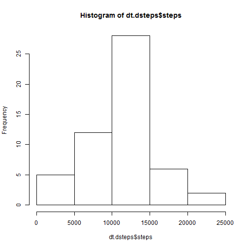
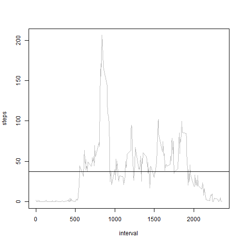
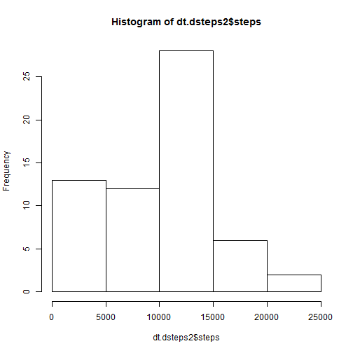
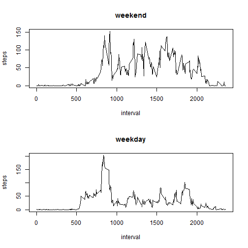

## Loading and preprocessing the data
==================================
Show any code that is needed to

1. Load the data (i.e. read.csv())

1. Process/transform the data (if necessary) into a format suitable for your analysis


```r
setwd('C:/Users/user/Downloads/Reproducible research/repResearchPA1')
df.data <- read.csv('./Data/activity.csv')
```

## What is mean total number of steps taken per day?

For this part of the assignment, you can ignore the missing values in the dataset.

1. Make a histogram of the total number of steps taken each day

1. Calculate and report the mean and median total number of steps taken per day


```r
library(data.table)
dt.dsteps <- data.table(df.data)
dt.dsteps <- dt.dsteps[,list(steps=sum(steps)), by='date']

hist(dt.dsteps$steps)
```

 

```r
summary(dt.dsteps$steps)[3:4]
```

```
## Median   Mean 
##  10800  10800
```

## What is the average daily activity pattern?

1. Make a time series plot (i.e. type = "l") of the 5-minute interval (x-axis) and 
the average number of steps taken, averaged across all days (y-axis)

1. Which 5-minute interval, on average across all the days in the dataset, 
contains the maximum number of steps?


```r
dt.isteps <- data.table(df.data[!is.na(df.data$steps),])
dt.isteps <- dt.isteps[,list(steps=mean(steps)), by='interval']

plot(dt.isteps, type='l', col='grey')
abline(h=summary(dt.isteps$steps)[4], col='black')
```

 

```r
dt.isteps[which.max(dt.isteps$steps),]
```

```
##    interval steps
## 1:      835 206.2
```

## Imputing missing values

1. Calculate and report the total number of missing values in the dataset (i.e. 
the total number of rows with NAs)

1. Devise a strategy for filling in all of the missing values in the dataset. 
The strategy does not need to be sophisticated. For example, you could use 
the mean/median for that day, or the mean for that 5-minute interval, etc.

1. Create a new dataset that is equal to the original dataset 
but with the missing data filled in.

1. Make a histogram of the total number of steps taken each day and Calculate 
and report the mean and median total number of steps taken per day. 
Do these values differ from the estimates from the first part of the assignment? 
What is the impact of imputing missing data on the estimates of the total daily number of steps?


```r
sum(is.na(df.data$steps))
```

```
## [1] 2304
```

```r
dt.dsteps2 <- data.table(df.data)
dt.dsteps2 <- dt.dsteps2[,list(steps=mean(steps)), by='date']
dt.dsteps2[is.na(dt.dsteps2$steps),'steps'] <- 0

df.data2 <- df.data

for (i in 1:length(dt.dsteps2$date)) {
    df.data2[which(is.na(df.data2$steps) & df.data2$date == dt.dsteps2$date[i]),'steps'] <- dt.dsteps2$steps[1]
}

dt.dsteps2 <- data.table(df.data2)
dt.dsteps2 <- dt.dsteps2[,list(steps=sum(steps)), by='date']
dt.dsteps2[is.na(dt.dsteps2$steps),'steps'] <- 0

hist(dt.dsteps2$steps)
```

 

```r
summary(dt.dsteps$steps)[3:4]
```

```
## Median   Mean 
##  10800  10800
```

```r
summary(dt.dsteps2$steps)[3:4]
```

```
## Median   Mean 
##  10400   9350
```

In the second part of the assignment the mean and median values are smaller than in the first part.

## Are there differences in activity patterns between weekdays and weekends?

1. Create a new factor variable in the dataset with two levels – “weekday” 
and “weekend” indicating whether a given date is a weekday or weekend day.

1. Make a panel plot containing a time series plot (i.e. type = "l") of the 
5-minute interval (x-axis) and the average number of steps taken, 
averaged across all weekday days or weekend days (y-axis). The plot should 
look something like the following, which was creating using simulated data:


```r
df.data2$day <- weekdays(as.Date(df.data2$date))
df.data2$day[which(df.data2$day == 'Saturday' | df.data2$day == 'Sunday')] <- 'weekend'
df.data2$day[which(df.data2$day != 'weekend')] <- 'weekday'

df.data2$day <- as.factor(df.data2$day)

dt.isteps2we <- data.table(df.data2[which(df.data2$day == 'weekend'),])
dt.isteps2we <- dt.isteps2we[,list(steps=mean(steps)), by='interval']

dt.isteps2wd <- data.table(df.data2[which(df.data2$day == 'weekday'),])
dt.isteps2wd <- dt.isteps2wd[,list(steps=mean(steps)), by='interval']


par(mfrow=c(2,1)) 
plot(dt.isteps2we, type='l', main='weekend')
plot(dt.isteps2wd, type='l', main='weekday')
```

 

